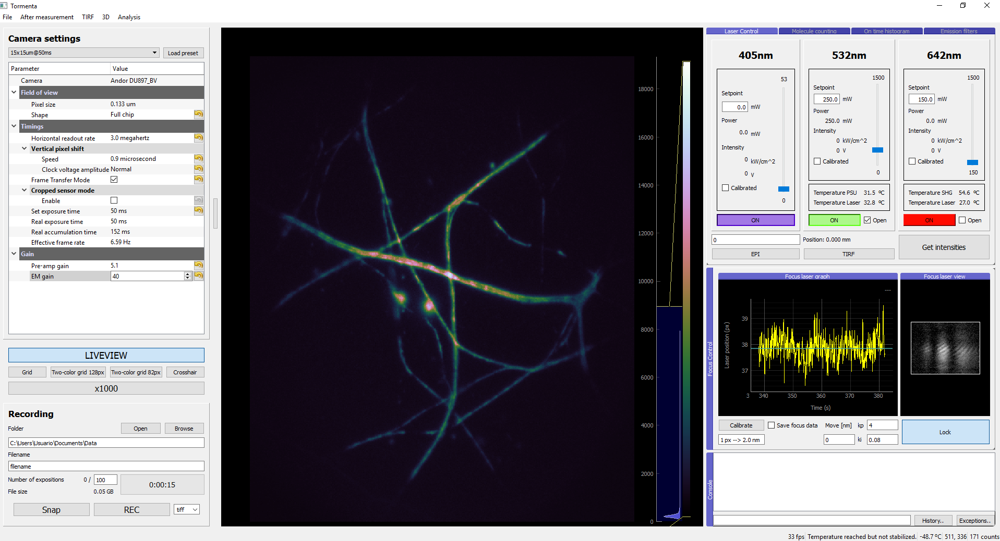

Tormenta
========

Measurement control and analysis for optical microscopy



Installation
~~~~~~~~~~~~

Ubuntu
^^^^^^

Run in terminal:

::

    ```
    $ sudo apt-get install python3-pip python3-h5py git
    $ sudo pip3 install comtypes lantz tifffile pyqtgraph
    $ git clone https://github.com/fedebarabas/Tormenta
    ```

Windows
^^^^^^^

-  Install `WinPython
   3.4 <https://sourceforge.net/projects/winpython/files/>`__.
-  Browse to `Laboratory for Fluorescence
   Dynamics <http://www.lfd.uci.edu/~gohlke/pythonlibs/>`__ and download
   tifffile for Python 3.4 to
   ``$PATH\WinPython-64bit-3.4.4.1\python-3.4.4.amd64\``.
-  Open WinPython Command Prompt and run:

   ::

       $ pip install comtypes lantz tifffile-2016.4.19-cp34-cp34m-win_amd64.whl

-  Clone `Tormenta repo <https://github.com/fedebarabas/tormenta>`__.

Optional dependencies
^^^^^^^^^^^^^^^^^^^^^

Don't install these libraries if you have different equipment or you
just want to test the software without instruments (offline mode). -
Support for Labjack's T7 DAQ - `LJM
Library <https://labjack.com/support/software/installers/ljm>`__ - `LJM
Library Python
wrapper <https://labjack.com/support/software/examples/ljm/python>`__ -
Support for webcam image acquisition - Pygame

Launch Tormenta
~~~~~~~~~~~~~~~

-  Open WinPython Command Prompt, go to tormenta's repository directory
   and run:

   ::

       $ python -m tormenta

Documentation
~~~~~~~~~~~~~

The documentation is under construction in
`http://fedebarabas.github.io/tormenta/ <http://fedebarabas.github.io/tormenta/>`__

How to cite
~~~~~~~~~~~

If you used the code/program for your paper, please cite

Barabas et al., *Note: Tormenta: An open source Python-powered control software for camera based optical microscopy*, Review of Scientific Instruments, 2016.

https://doi.org/10.1063/1.4972392

Contact
~~~~~~~

Feel free to contact me with comments or suggestions. Use any part of
the code that suits your needs.

Federico Barabas fede.barabas[AT]gmail.com
